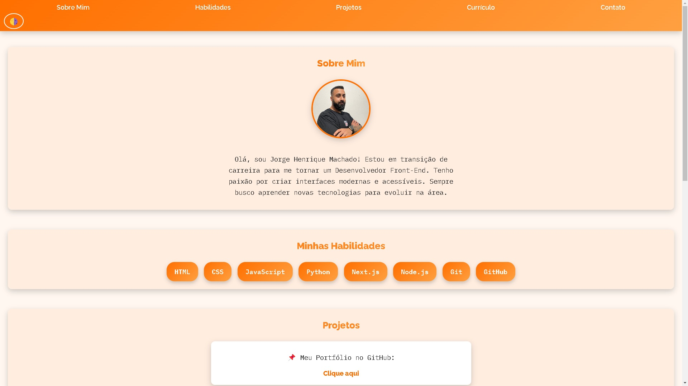
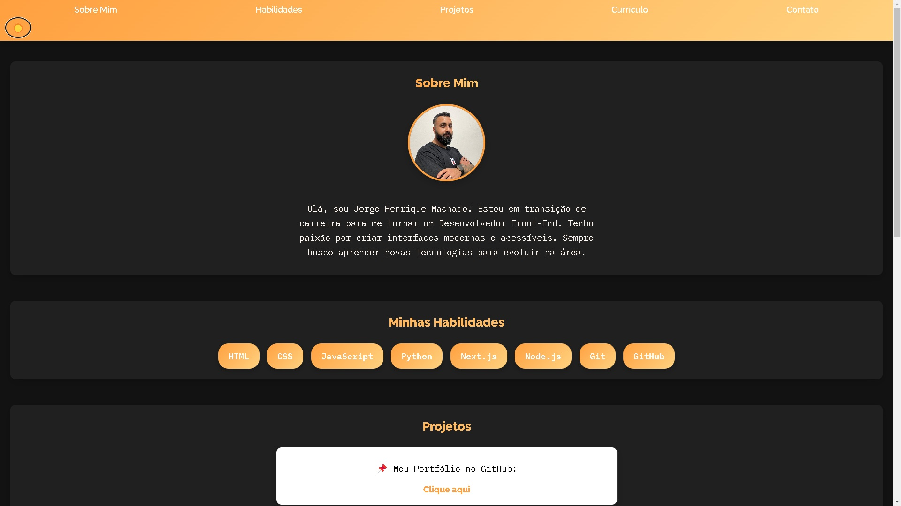

# Projeto de Portfólio

Este é um projeto de portfólio desenvolvido com o objetivo de exibir minhas habilidades como Desenvolvedor Front-End. O projeto utiliza diversas tecnologias para criar uma interface moderna e funcional.

## Tecnologias Utilizadas 🚀

## Acesse o Projeto Online 🌐

[Veja o projeto no GitHub Pages](https://machadojorgeh.github.io/Projeto-Portifolio/)

## Imagens do Projeto 📸

### Tema Claro

### Tema Escuro

## Descrição do Projeto 📝

Este portfólio foi desenvolvido com foco em demonstrar as habilidades de um Desenvolvedor Front-End, incluindo a criação de interfaces responsivas e agradáveis. As tecnologias principais utilizadas são HTML, CSS, JavaScript, Git e GitHub.

---

**Jorge Henrique Machado**  
[GitHub](https://github.com/MachadoJorgeH) | [LinkedIn](https://www.linkedin.com/in/jorge-henrique-machado/)
